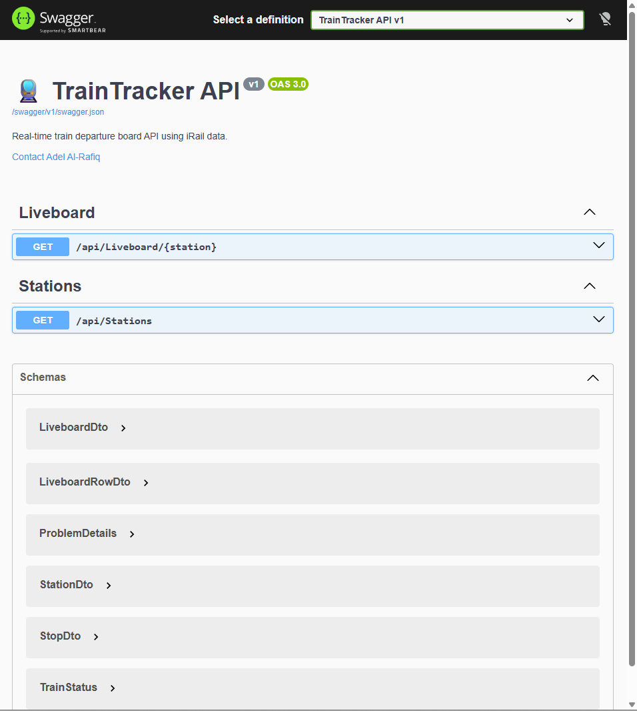

##🚆 TrainTracker API

A modern full-stack backend API for a real-time train departure board application inspired by European railway station displays.

This API integrates with the public iRail API to provide live departures, train stop information, delay handling, and station search functionality for the frontend application.

---

##🌍 Live API

🔗 https://traintracker-1.onrender.com/swagger/index.html

📸 Swagger Preview


---

##✨ Features
*🚉 Real-time train departure board
*🔍 Station search with autocomplete support
*🚦 Train delay and cancellation status handling
*🛤️ Dynamic train stops calculation
*⚡ In-memory caching for performance optimization
*🔄 External railway API integration (iRail)
*📡 RESTful API architecture

---

##🛠️ Tech Stack
*ASP.NET Core Web API
*C#
*MemoryCache
*HttpClient
*REST API
*JSON Serialization
*DTO Mapping Layer

---

##📂 Project Structure

```
Controllers/
Mappings/
Models/
 ├── Api/
 └── DTOs/
Services/
 ├── Implementations/
 └── Interfaces/
 ```

---

##🧠 Architecture

*The backend follows a service-based architecture:

**Controllers → Services → Mapping Layer → External API

*The application uses:

**DTO mapping for optimized frontend responses
Memory caching to reduce repeated external API requests
**Async processing for concurrent train stop loading

---

##📡 API Endpoints
*🚉 Liveboard

```

GET /api/liveboard/{station}

Example:

GET /api/liveboard/Gent-Sint-Pieters

Response:

{
  "stationName": "Gent-Sint-Pieters",
  "latitude": 51.035896,
  "longitude": 3.710675,
  "rows": [
    {
      "directionName": "Brussel-Zuid",
      "departureTime": "2026-05-11T10:15:00+00:00",
      "platform": "8",
      "vehicleInfoShortname": "IC 1832",
      "delayMinutes": 2,
      "status": "Delayed"
    }
  ]
}

```

---

##🔍 Stations Search

```

GET /api/stations?query={text}

Example:

GET /api/stations?query=Gen

Response:

[
  { "name": "Gent-Sint-Pieters" },
  { "name": "Genk" }
]

```

---

##⚡ Caching Strategy

*The API uses in-memory caching to improve performance and reduce unnecessary external API calls.

*Implemented caching:

*Liveboard caching
*Vehicle/stops caching
*Sliding expiration
*Absolute expiration

---

##🌍 External API

*This project uses the public iRail API:

**iRail API

##📄 API Documentation (Swagger)

*Interactive Swagger documentation available at:

🔗 https://traintracker-1.onrender.com/swagger

---

##⚙️ Setup
*Clone repository
git clone https://github.com/adelalrafiq/TrainTracker.git
*Run locally
*dotnet run

*API runs on:

https://localhost:5000

---

##🌐 Deployment

*Backend deployed using:

**Render
⚠️ Notes
*Backend is hosted on Render free tier
*First request may take a few seconds due to cold start
*Data is provided by the public iRail API

---

##🔮 Future Improvements
*⚡ Real-time updates using SignalR
*🧠 Distributed caching (Redis)
*🔐 JWT authentication
*📊 API monitoring and logging

---

##🔗 Related
Frontend Repository

https://github.com/adelalrafiq/train-tracker-ui

Live Frontend

https://train-tracker-ui-fdfc.vercel.app/liveboard

---

##👨‍💻 Author

**Adel Al-Rafiq 🚀**
**Full Stack Developer**